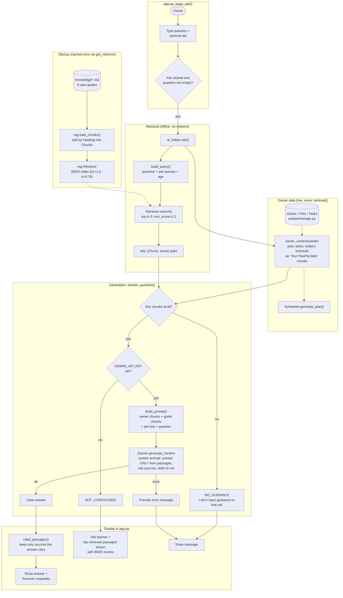

# Ask PawPal: RAG Flow

```mermaid
flowchart TD
    subgraph Startup["Startup (cached once via get_retriever)"]
        KB[("knowledge/*.md<br/>6 care guides")] --> LC["rag.load_chunks()<br/>split by heading into Chunks"]
        LC --> IDX["rag.Retriever<br/>BM25 index (k1=1.5, b=0.75)"]
    end

    subgraph UI["app.py: page_ask()"]
        U(["Owner"]) --> Q["Type question +<br/>optional pet"]
        Q --> BTN{"Ask clicked and<br/>question not empty?"}
    end

    BTN -- yes --> ASK["ai_helper.ask()"]

    subgraph Retrieval["Retrieval (offline, no network)"]
        ASK --> BQ["build_query()<br/>question + pet species + age"]
        BQ --> SEARCH["Retriever.search()<br/>top k=3, min_score=1.0"]
        IDX -.-> SEARCH
        SEARCH --> HITS["hits: (Chunk, score) pairs"]
    end

    subgraph Owner["Owner data (live, never retrieved)"]
        ASK --> OC["owner_context(owner)<br/>pets, tasks, today's schedule<br/>as 'Your PawPal data' chunks"]
        OD[("Owner / Pets / Tasks<br/>pawpal/storage.py")] -.-> OC
        OC -.-> SCH["Scheduler.generate_plan()"]
    end

    subgraph Generation["Generation: answer_question()"]
        HITS --> EMPTY{"Any chunks at all?"}
        OC --> EMPTY
        EMPTY -- no --> NG["NO_GUIDANCE<br/>'I don't have guidance on that yet'"]
        EMPTY -- yes --> KEY{"GEMINI_API_KEY<br/>set?"}
        KEY -- no --> NC["NOT_CONFIGURED"]
        KEY -- yes --> PR["build_prompt()<br/>owner chunks + guide chunks<br/>+ pet line + question"]
        PR --> GEM["Gemini generate_content<br/>system prompt: answer ONLY from passages,<br/>cite sources, defer to vet"]
        GEM -- error --> ERR["Friendly error message"]
        GEM -- ok --> ANS["Cited answer"]
    end

    subgraph Display["Display in app.py"]
        ANS --> CITE["cited_passages()<br/>keep only sources the answer cites"]
        CITE --> OUT["Show answer +<br/>'Sources' expander"]
        NC --> FALL["Info banner +<br/>top retrieved passages shown<br/>with BM25 scores"]
        NG --> OUT2["Show message"]
        ERR --> OUT2
    end
```
